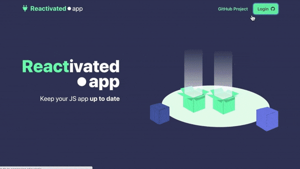

# [](https://reactivated.app)

[![prettier][prettier-badge]][prettier-url]
[![TypeScript][typescript-badge]][typescript-url]

Reactivated.app is an open-source app that scans your JS dependencies every 4 hours and generates a cool sum up.

## Quick Demo



## Features

- Support for NPM dependencies
- Import your GitHub repositories
- Visualizing your project's health
- Detection of the framework used
- Grouping the different dependencies by a common prefix
- **Beta** Automated PR in a new branch with the up-to-date dependencies _(⚠️only supporting yarn.lock : will be created even if there is a package-lock.json)_

## Getting started

##### Prerequisites

- IDE with TypeScript, Prettier and ESLint support
- Node installed
- Yarn installed

### API

#### Installation

```bash
$ cd api
$ yarn
```

```bash
cp .env.dist .env.dev
```

#### Running the app

```
# watch mode
$ yarn start:dev

# start workers
yarn start:worker

# handle GitHub webhooks with Smee
$ yarn smee
```

The API should be available on [http://localhost:3000](http://localhost:3000) (the swagger doc is available on [http://localhost:3000/swagger](http://localhost:3000/swagger))

#### Webhook (GitHub API)

Forward the payload from GitHub API to our local dev API thanks to [Smee](https://github.com/probot/smee.io).

```bash
smee --url https://smee.io/BVk7Sqmgj7fXXcV --path /webhooks/consume --port 3000
```

#### Test

```bash
# unit tests
$ npm run test

# e2e tests
$ npm run test:e2e

# test coverage
$ npm run test:cov
```

### Front

#### Installation and .env config

```bash
cd front
cp f.env.dist .env
yarn
```

#### Run the app

```bash
yarn start
```

The app should be available on [http://localhost:3007](http://localhost:3007)

#### Webpack config

We use `customize-cra` to add some additional configuration to Webpack.
One of those configuration is `aliases`. Whenever creating a new folder in the src folder, make sure it's correctly configured in the Webpack configuration.

#### Build the app

```bash
yarn build
```

---

## 💪 Built with

We use TypeScript ❤️ for static typing

### API

- [Nestjs](https://nestjs.com/)
- [Nestjs Crud](https://github.com/nestjsx/crud)
- [MySQL](https://www.mysql.com/) or [PostgreSQL](https://www.postgresql.org/) for the database
- [Bull](https://github.com/OptimalBits/bull) with [Redis](https://redis.io/) for computing expensive operations with the worker process

### Front

- [Create React App](https://github.com/facebook/create-react-app)
- [Chakra UI](https://chakra-ui.com/)
- [SWR](https://github.com/vercel/swr)
- [Framer motion](https://www.framer.com/motion/) for custom animations

## Contributing

1. [Fork](https://help.github.com/articles/fork-a-repo/) this repository to your own GitHub account and then [clone](https://help.github.com/articles/cloning-a-repository/) it to your local device
2. Install the dependencies (follow these instructions for the [API](api/README.md) and [Front](front/README.md))
3. Start the app, build your new feature and submit your pull request

OR

Make a new issue according to this [template](.github/ISSUE_TEMPLATE/custom.md)

[typescript-badge]: https://badges.frapsoft.com/typescript/code/typescript.svg?v=101
[typescript-url]: https://github.com/microsoft/TypeScript
[prettier-badge]: https://img.shields.io/badge/code_style-prettier-ff69b4.svg
[prettier-url]: https://github.com/prettier/prettier
